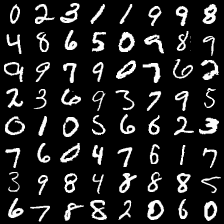
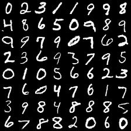
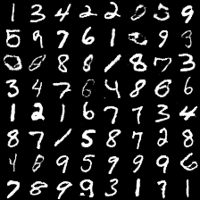

# ICGan-tensorflow
the test code of [Invertible conditional GANs for image editing](https://arxiv.org/abs/1611.06355) using Tensorflow.

[The Torch code of Author](https://github.com/Guim3/IcGAN).
##INTRODUCTION
In this paper , a real image can be encoded into a latent code z and conditional information y,and then reconstucted to the origial image by generative model of Gans.The paper fix z and modify y to obtain variations of the original image.

The IcGAN is trained in three steps.

    1.Train the Gan.
    2.Train the encoder Z to map an image x to a latent representation z with the dataset generated images.
    3.Train the encoder Y to map an image x to a conditional information vector y with the dataset of real images.

##Prerequisites

- tensorflow 1.0

- python 2.7

- opencv 2.4.8

##Usage

  Download mnist:
  
    $ python download.py
  
  Train Gan:
  
    $ python main.py --OPER_FLAG 0
  
  Train Encode z:
  
    $ python main.py --OPER_FLAG 1
  
  Train Encode y:
  
    $ python main.py --OPER_FLAG 2
  
  Test to reconstuction:
  
    $ python main.py --OPER_FLAG 3 --extend 0
  
  Test new result:
  
    $ python main.py --OPER_FLAG 3 --extend 1

##Result of Test in mnist dataset:

The original image:

The restruction image:

The new sample of changing y:

##Reference code

[DCGAN](https://github.com/carpedm20/DCGAN-tensorflow)
